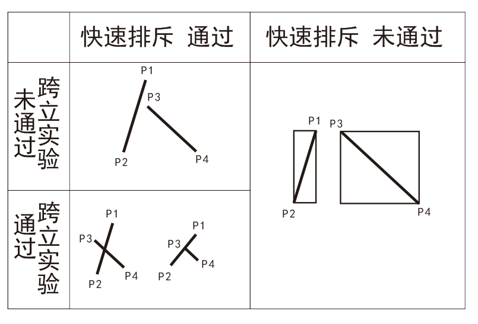
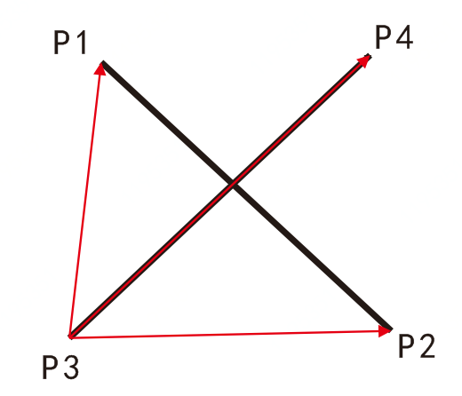

两点线段是否相交，是最经典的计算几何问题之一，它和点是否在多边形内，是所有GIS空间计算的基础。

计算两点线段是否相交，要通过两个步骤，首先判断它们的最小外包矩形（MBR）是否相交，如果外包矩形不相交，那么线段也不相交；如果外包矩形相交，那么进行叉积运算。

1.MBR快速排斥

即判断以两线段为对角线的矩形是否相交，若不相交，则两线段一定不相交。

判断两个矩形是否相交，只要任一矩形的最右端都大于另一矩形的最左端且任一矩形最高端大于另一矩形的最低端，则两矩形相交；反之，若其中任一条件不满足，两矩形不相交。





MBR快速排斥伪码：

```javascript
isIntersectMBR：

if(

max(p1.x,p2.x)>=min(p3.x,p4.x) #矩形1最右端大于矩形2最左端

and max(p3.x,p4.x)>=min(p1.x,p2.x) #矩形2最右端大于矩形最左端

and max(p1.y,p2.y)>=min(p3.y,p4.y) #矩形1最高端大于矩形最低端

and max(p3.y,p4.y)>=min(p1.y,p2.y) #矩形2最高端大于矩形最低端

): true

else:false
```

返回true，则最小外包矩形相交。


2.跨立实验

若两线段相交，则两线段必须跨立。

线段P1P2与线段P3P4相交，则P1和P2一定在线段P3P4的两侧。

判断线段P1P2跨立线段P3P4的条件是(P3P1×P3P4) ×(P3P2×P3P4)≤0

判断线段P3P4跨立线段P1P2的条件是(P2P3×P2P1) ×(P2P4×P2P1)≤0

等于0是共线情况。





跨立实验伪码：

叉积计算：

cross(p1,p2,p3):

x1=p2.x-p1.x

y1=p2.y-p1.y

x2=p3.x-p1.x

y2=p3.y-p1.y

return x1*y2-x2*y1

判断语句：

if(cross(p1,p2,p3)*cross(p1,p2,p4)<=0 and cross(p3,p4,p1)*cross(p3,p4,p2)<=0):true

else:false


如果isIntersectMBR为false，不相交。

如果isIntersectMBR为true，cross为false，则不相交，为true，则相交。

```javascript

/**
* 线段与线段的关系
* @param line1 线段；[[经度,纬度],[经度,纬度]]；例：[[116.01,40.01],[116.52,40.01]]
* @param line2 线段；[[经度,纬度],[经度,纬度]]；例：[[116.33,40.21],[116.36,39.76]]
*
* @return intersect 线段与线段的关系；0:相离，1：相交，2：相切
*/
function intersectLineAndLine(line1, line2) {
  var x1 = line1[0][0],
    y1 = line1[0][1],
    x2 = line1[1][0],
    y2 = line1[1][1],
    x3 = line2[0][0],
    y3 = line2[0][1],
    x4 = line2[1][0],
    y4 = line2[1][1]

  //快速排斥：
  //两个线段为对角线组成的矩形，如果这两个矩形没有重叠的部分，那么两条线段是不可能出现重叠的

 //这里的确如此，这一步是判定两矩形是否相交
  //1.线段ab的低点低于cd的最高点（可能重合）
  //2.cd的最左端小于ab的最右端（可能重合）
  //3.cd的最低点低于ab的最高点（加上条件1，两线段在竖直方向上重合）
  //4.ab的最左端小于cd的最右端（加上条件2，两直线在水平方向上重合）
  //综上4个条件，两条线段组成的矩形是重合的
  //特别要注意一个矩形含于另一个矩形之内的情况
  if (!(Math.min(x1, x2) <= Math.max(x3, x4) && Math.min(y3, y4) <= Math.max(y1, y2) &&
      Math.min(x3, x4) <= Math.max(x1, x2) && Math.min(y1, y2) <= Math.max(y3, y4))) {
    return 0
  }

  // 判断点与线段的相对位置，0为在线段上，>0 点在左侧，<0 点在右侧
  if (isLeft(line1[0], line2) === 0 || isLeft(line1[1], line2) === 0) {
    return 2
  }

  //跨立实验：
  //如果两条线段相交，那么必须跨立，就是以一条线段为标准，另一条线段的两端点一定在这条线段的两段
  //也就是说a b两点在线段cd的两端，c d两点在线段ab的两端
  var kuaili1 = ((x3 - x1) * (y2 - y1) - (x2 - x1) * (y3 - y1)) * ((x4 - x1) * (y2 - y1) - (x2 - x1) * (y4 - y1))
  var kuaili2 = ((x1 - x3) * (y4 - y3) - (x4 - x3) * (y1 - y3)) * ((x2 - x3) * (y4 - y3) - (x4 - x3) * (y2 - y3))
  return Number(Number(kuaili1.toFixed(10)) <= 0 && Number(kuaili2.toFixed(10)) <= 0)
}
```